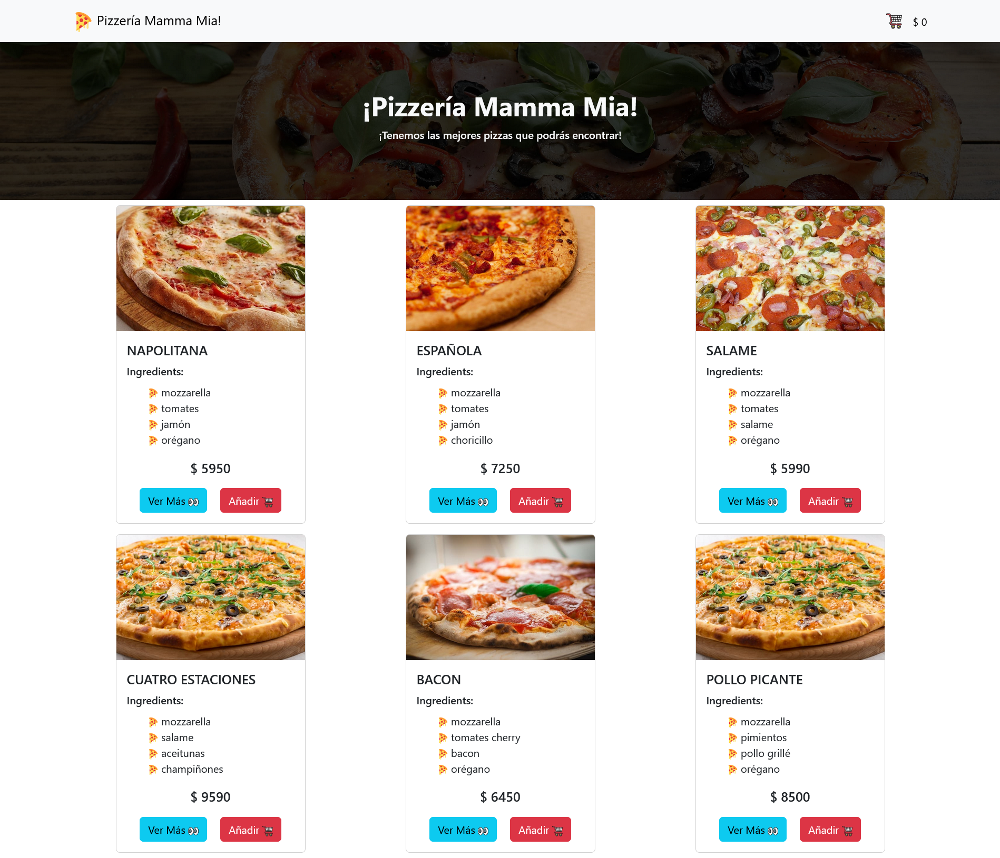
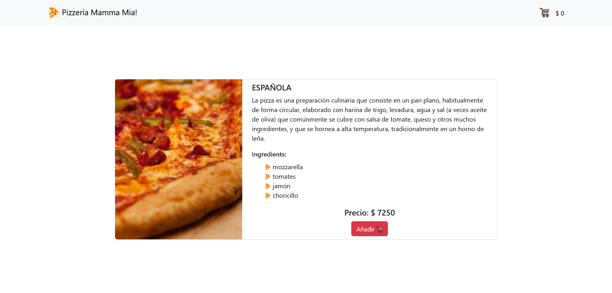
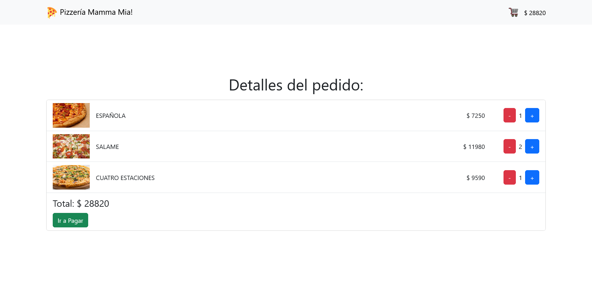

# Desafío - Mamma Mia!

En este desafío, he desarrollado una aplicación web para la pizzería italiana Mamma Mia! SPA. La aplicación muestra y vende diferentes tipos de pizzas, con la posibilidad de ver detalles de cada pizza, agregarlas al carrito y ver el total a pagar.

## Capturas de Pantalla 🖼️

### Pantalla Inicial


### Descripción del Producto


### Detalle del Pedido


## Requerimientos del Desafío 🎯

1. **Crear vistas y componentes para las siguientes rutas:**
   - /Home: Mostrar el catálogo de pizzas.
   - /pizza/:id: Mostrar el detalle de una pizza seleccionada.
   - /carrito: Mostrar las pizzas añadidas al carrito con sus precios y total a pagar.

2. **Utilizar React Router como gestor de rutas de la aplicación.**

3. **Manejar el estado global de la aplicación con Context API.**

## Tecnologías Utilizadas 💻

- React
- React Router
- Bootstrap

## Estructura del Código 🧱

La aplicación está estructurada utilizando React, con componentes individuales para las páginas de inicio, detalles de la pizza y carrito de compras. Se ha utilizado React Router para la navegación entre las diferentes vistas de la aplicación, y Context API para manejar el estado global de la aplicación.

## Código Relevante 🧩

### Contexto PizzasContext

Este contexto se utiliza para manejar el estado global de las pizzas, el carrito de compras y la funcionalidad relacionada con la selección y agregado de pizzas.

```javascript
// Archivo: PizzasContext.js

import { createContext, useState, useEffect } from "react";
import { useNavigate } from "react-router-dom";

export const PizzasContext = createContext();

const PizzasProvider = ({ children }) => {

  const [pizzas, setPizzas] = useState([]);
  const [pizzaSelected, setPizzaSelected] = useState([]);
  const [cart, setCart] = useState([]);
  const [total, setTotal] = useState(0);

  const navigate = useNavigate();

  // Funciones y efectos para obtener datos, calcular total, seleccionar y agregar pizzas al carrito

  const globalState = { pizzas, pizzaSelected, cart, total, /* Otras funciones y estados relevantes */ };

  return (
    <PizzasContext.Provider value={globalState}>
      {children}
    </PizzasContext.Provider>
  );
}

export default PizzasProvider;
```

### Componente CardPizza

Este componente muestra las tarjetas individuales de cada pizza en la página de inicio, con la opción de ver más detalles o agregarlas al carrito.

```javascript
// Archivo: CardPizza.js

import { useContext } from "react";
import { PizzasContext } from "../context/PizzasContext";
import ButtonCTA from "./ButtonCTA";

const CardPizza = () => {

  const { pizzas, botones, handleVerPizzaSelected, handleAgregarPizzaSelected } = useContext(PizzasContext);

  return (
    <div className="row card-pizza-container">
      {pizzas && pizzas.map(pizza => (
        <div key={pizza.id + pizza.name} className="col-sm-12 col-md-6 col-lg-4 d-flex justify-content-center my-2">
          <div className="card" style={{ width: '18rem' }}>
            {/* Contenido de la tarjeta de la pizza */}
          </div>
        </div>
      ))}
    </div>
  );
}

export default CardPizza;
```

### Componente OrderedPizzaDetails

Este componente muestra los detalles de las pizzas agregadas al carrito, permitiendo aumentar o disminuir la cantidad y realizar el pago total.

```javascript
// Archivo: OrderedPizzaDetails.js

import { useContext } from "react";
import { PizzasContext } from "../context/PizzasContext";

const OrderedPizzaDetails = () => {
  const { cart, addPizzaButton, subtractPizzaButton, total, pagarFunction } =
    useContext(PizzasContext);

  return (
    <div className="ordered-pizza-details-container my-2">
      {/* Contenido del detalle del pedido */}
    </div>
  );
};

export default OrderedPizzaDetails;
```

### Otros Componentes y Archivos Relevantes

Además de los componentes mencionados anteriormente, también se utilizaron otros componentes como ButtonCTA, Header, y se cargaron datos de las pizzas desde el archivo pizzas.json.

## Mejoras Futuras 🚀

Para futuras iteraciones de la aplicación, se podría considerar agregar funcionalidades adicionales como la búsqueda de pizzas, la posibilidad de guardar pizzas favoritas y mejorar el diseño de la interfaz de usuario.